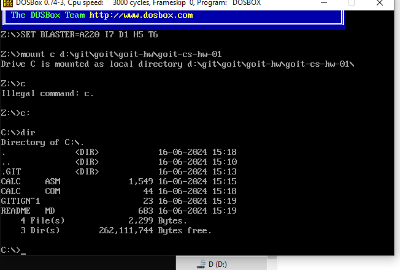
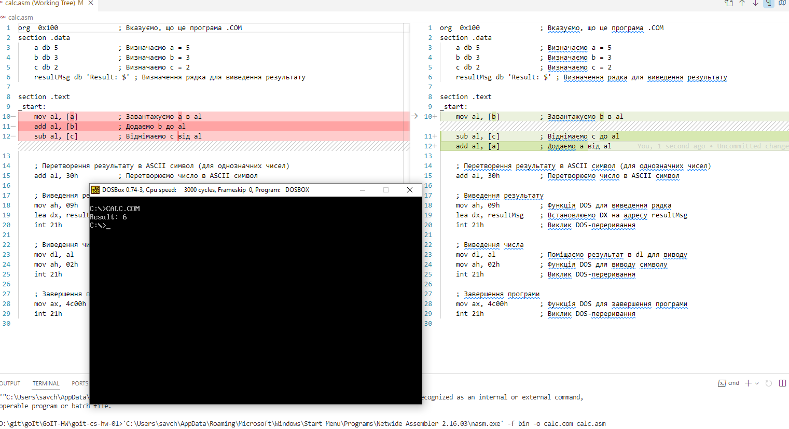
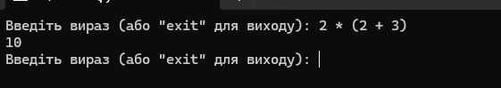

# Завдання 1

Розробіть програму на асемблері, яка виконує обчислення арифметичного виразу b - c + a.

Використовуйте як основу приклад програми для обчислення a + b - c, представлений у конспекті (посилання на папку репозиторію до конспекту), але з необхідними модифікаціями для вирішення цього завдання.

## Результат

```cmd
"C:\Users\_username_\AppData\Local\bin\NASM\nasm.exe" -f bin -o calc.com calc.asm        
```




# Завдання 2

У вас є початковий код інтерпретатора з конспекту, який вміє обробляти арифметичні вирази, включаючи операції додавання та віднімання.

Ваше завдання полягає в розширенні цього інтерпретатора таким чином, щоб він також підтримував операції множення та ділення, а також коректно обробляв вирази, що містять дужки.

